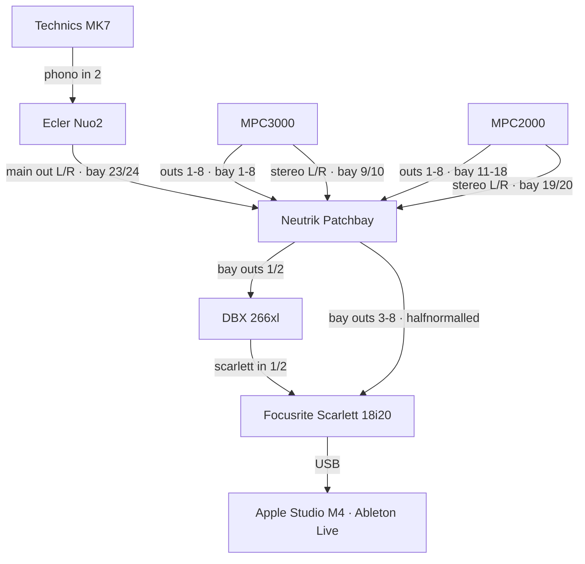

# Boombap Sampling Home Studio

Hardware-first home studio for making boombap hip-hop beats. Vinyl sampling through Akai MPCs, multitrack recording into Ableton for mixdown.

## Workflow

1. Sample from vinyl (Technics MK7 → Ecler Nuo2 → MPC)
2. Build the beat on one MPC per project (MPC3000, MPC2000, or MPC2500)
3. Record 8 individual MPC outs through the patchbay into a Focusrite Scarlett 18i20
4. Mixdown in Ableton Live

## Signal Chain

## Patchbay Routing

The Neutrik patchbay is halfnormalled on bays 1-8: MPC3000 is the default routing to the Scarlett. Patch MPC2000 (bays 11-18) manually when switching samplers. The DBX 266xl is inserted on channels 1 and 2 between the patchbay and the Scarlett.
