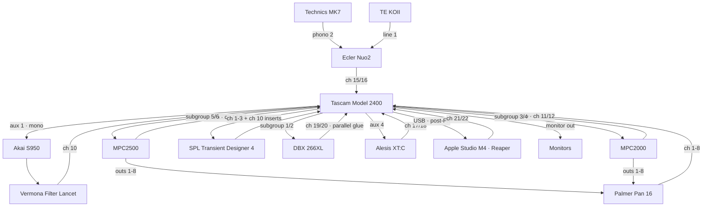

# Boombap Sampling Home Studio

Hardware-first home studio for making boombap hip-hop beats. Vinyl sampling through Akai MPCs,
sound-modeled on a Tascam Model 2400 and outboard, mixed and mastered in Reaper.

**The division of labour:** the Tascam and the analog gear do the sound modeling — EQ,
transient shaping, glue, reverb — decided in the moment and printed on the way in, where it
cannot be changed afterwards. The DAW does the mixing: balance, surgical corrections, delay and reverb.
Mastering is a third stage in its own project.

## Workflow

1. Sample from vinyl (Technics MK7 → Ecler Nuo2 → Tascam), into the MPC directly or via the Akai S950
2. Build the beat on one MPC per project (MPC2500 or MPC2000 — never both)
3. Track the 8 individual MPC outs through the Palmer Pan 16 into Tascam ch 1-8
4. Shape the sound on the Tascam and the outboard — EQ, SPL, DBX glue, XT:C
5. Capture over USB **post-FX and pre-fader**: the tone prints, the balance does not. Stereo master **and** per-channel multitrack on every beat, one take, nothing rewired
6. Mix in Reaper from the multitrack — balance, surgical Pro-Q, delay and reverb buses
7. Master in Reaper, in a separate project — three plugins to −12 LUFS

## Signal Chain

```mermaid
graph TD
    TT[Technics MK7] -->|phono 2| ECL[Ecler Nuo2]
    KOII[TE KOII] -->|line 1| ECL
    ECL -->|ch 15/16| T[Tascam Model 2400]

    MPC2500 -->|outs 1-8| PAL[Palmer Pan 16]
    MPC2000 -->|outs 1-8| PAL
    PAL -->|ch 1-8| T
    MPC2000 -->|stereo · ch 11/12| T
    MPC2500 -->|stereo · ch 13/14| T

    S950[Akai S950] --> VER[Vermona Filter Lancet]
    VER -->|ch 10| T

    T -->|ch 1-3 + ch 10 inserts| SPL[SPL Transient Designer 4]
    SPL --> T
    T -->|subgroup 1/2| DBX[DBX 266XL]
    DBX -->|ch 19/20 · parallel glue| T
    T -->|aux 4| XTC[Alesis XT:C]
    XTC -->|ch 17/18| T

    T -->|aux 1 · mono| S950
    T -->|subgroup 3/4| MPC2000
    T -->|subgroup 5/6| MPC2500

    T -->|USB · post-FX| MAC[Apple Studio M4 · Reaper]
    MAC -->|ch 21/22| T
    T -->|monitor out| MON[Monitors]
```

The `.drawio` file has two pages: **Overview** (the physical signal chain above) and
**Mixing and mastering** (the three stages inside the box — capture passes, the mixing project,
the mastering project). Both are combined onto one A3 sheet in
[studio-signal-chain.pdf](studio-signal-chain.pdf) for printing; regenerate it after editing the
diagram with `tools/export-pdf.sh`.

## Key routing decisions

- **Drums are glued in parallel, not inserted.** Ch 1-3 feed subgroup 1/2 → DBX 266XL → back
  in on ch 19/20, blended under the dry channels. The compressed copy can be crushed hard
  because the dry channels keep the transients.
- **Sample-sends are subgroups, not auxes.** Subgroup 3/4 → MPC2000 and 5/6 → MPC2500 give a
  stereo, post-fader feed with its own level control, and leave three auxes free.
- **Capture is post-FX and pre-fader.** The desk EQ and the SPL transient shaping print; the
  fader positions do not. The multitrack is deliberately not a set of dry stems, and it arrives
  level-normalised at ≈ −10 dBFS per channel with the balance still to be built.

## Docs

- [CLAUDE.md](CLAUDE.md) — full routing, gear list, rack layout, capture constraints
- [manual_mixing_tascam_reaper.md](manual_mixing_tascam_reaper.md) — the mixing stage: capture, the Reaper template, kick/bass ducking, delay and reverb buses
- [manual_mastering_reaper.md](manual_mastering_reaper.md) — the three-plugin mastering chain with exact values
- [reaper_mastering_session.md](reaper_mastering_session.md) — how the mastering project is laid out, and why it is separate
- [dbx266xl-reference.md](dbx266xl-reference.md) — DBX 266XL settings for parallel drum glue
